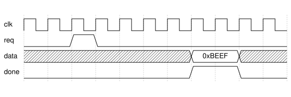

<center>
    <h1>wavedrom-rs </h1>
    <h3>A Rust <b>Digital Timing Diagram</b> generator based on <a href="https://wavedrom.com/">WaveDrom</a></h3>
</center>

---

[Demo][demo] | [Tutorial][book]

The `wavedrom-rs` crate provides an interface to shape beautiful [Digital Timing
Diagrams][dtd] into a [SVG][svg] or [PNG][png] file. It is almost completely compatible with the
[WaveDrom][wavedrom-js] project. It can be merged into document build tools,
continuous integration or be used as a one off to generate beautiful
diagrams.

<p align="center">
    
</p>

There are currently four ways to use `wavedrom-rs`:

- [On the editor website][demo]
- [As a Rust crate][cratesio]
- [As a Command-Line Application][cli]
- [As a MdBook Preprocessor][mdbook-wavedrom]

## Features

- [x] All original WaveDrom Signal Types
- [x] Signal Groups
- [x] Arrows and Indicator Markers
- [x] Headers and Footers
- [x] Cycle Enumeration Markers
- [x] Editor Website through WASM
- [x] MdBook Preprocessor
- [x] Full Customization via Skins

## Documentation

This project uses the same syntax for WaveJson as the original
[WaveDrom][wavedrom-js] project. Therefore, the original [Hitchhiker's Guide to
WaveDrom][hitchhiker] is still a good introduction into several concepts of
of WaveJson. Additionally, this repository maintains a [reference book][book].

## Testing

Tests are written in the [`./tests`](./tests) directory and can be generated
using the [`./tests/run.py`](./tests/run.py) scripts. This will generate a
`result.html` in the `tests` directory that contains all the rendered SVGs for
each `json5` file in the `./tests` directory.

```bash
# Usage:
cd ./tests
./run [path/to/skin.json5]
```

## Fuzzing

This project is fuzzed with [`cargo-fuzz`][cargo-fuzz]. This improves the
stability of the project.

```bash
cargo +nightly fuzz run wavejson-render
```

## MSRV

This crate currently only compiles with Rust 1.70. To select that version use:

```bash
rustup update 1.70 --no-self-update && rustup default 1.70
```

## Contribution

Please report any bugs and possible improvements as an issue within this
repository. Pull requests are also welcome.

## License

Licensed under a [MIT License](./LICENSE). The demo website utilizes icons from
[Lucide][lucide] which are licensed under an ISC license.

[demo]: https://gburghoorn.com/wavedrom
[svg]: https://en.wikipedia.org/wiki/SVG
[png]: https://en.wikipedia.org/wiki/PNG
[wavedrom-js]: https://wavedrom.com/
[tutorial]: https://wavedrom.com/tutorial.html
[lucide]: https://lucide.dev/
[hitchhiker]: https://wavedrom.com/tutorial.html
[cratesio]: https://crates.io/crates/wavedrom-rs
[cli]: ./wavedrom
[mdbook-wavedrom]: ./mdbook-wavedrom
[dtd]: https://en.wikipedia.org/wiki/Digital_timing_diagram
[book]: https://coastalwhite.github.io/wavedrom-rs
[cargo-fuzz]: https://github.com/rust-fuzz/cargo-fuzz